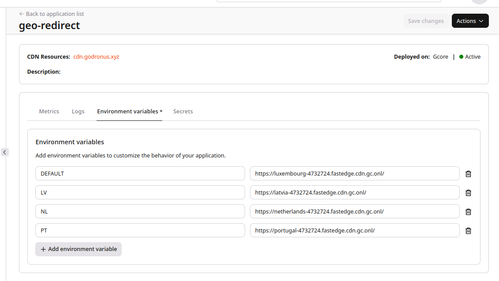

⏮️ Back to AssemblyScript [README.md](../../README.md)

# Geo Redirect

This application performs a simple check on the `country` code.

It compares this country code (from Geo-IP data) with configured (as variables) countries, in case of match it updates to the corresponding downstream `request.url`, otherwise to DEFAULT.

Please use ISO 3166-1 alpha-2 (two capital letters) country codes.

e.g.

