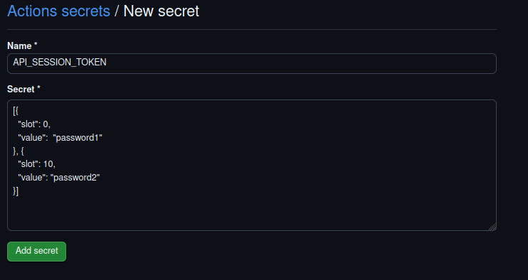
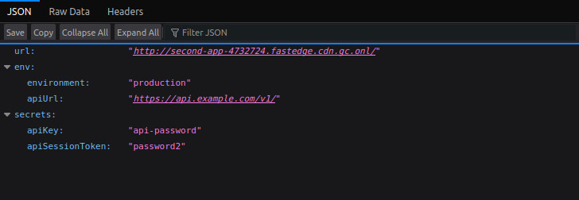

⏮️ Back to main [README.md](../README.md)

# Github Actions

This folder gives examples on how to use our [FastEdge Actions](https://github.com/gcore-github-actions/fastedge) to manage deployments to the FastEdge API.

### Folder Structure

The folder contains 2 examples:

- [Single Application per Workflow](./single-app-workflows/README.md) - This is the simplest setup, and the best place to start.

- [Multiple Applications with Release Artifacts](./multi-app-workflows/README.md) - This is a more advanced method, that uses Github Releases.

## About the Applications

Both folders are setup as a basic Javascript projects.

In the `./src` folder there are 2 simple applications. These are built using the npm scripts:

```sh
npm run build:first-app

&&

npm run build:second-app
```

Each of these scripts will output a build wasm to the `/dist` directory. ( which is included in `.gitignore`)

## First-app

This is a simple application that just responds with the request url

## Second-app

This application demonstrates how we can use "Response Headers", "Environment Variables" and "Secrets" whilst deploying an application.

Setting `secret_slots` secret within the Github Settings.



This application will respond with all the set values as `application/json` e.g.


