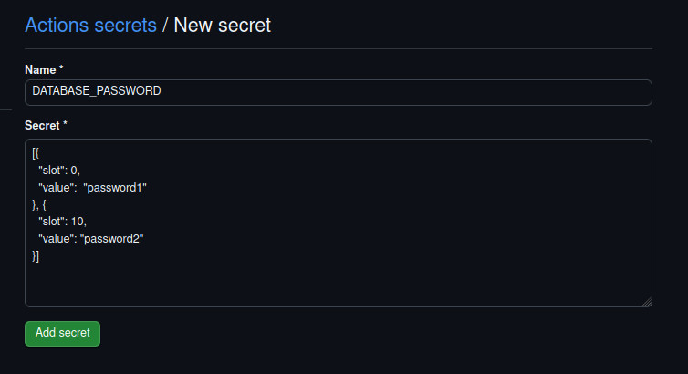
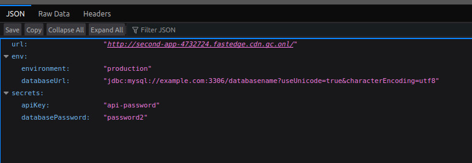

⏮️ Back to main [README.md](../README.md)

# GitHub Actions Examples

This folder contains an example GitHub workflow.

It demonstrates how you can use our [FastEdge Actions](https://github.com/gcore-github-actions/fastedge) to manage releasing applications to FastEdge.

### Folder Structure

The folder is setup as a basic Javascript project.

In the `./src` folder there are 2 simple applications. These are built using npm scripts:

```sh
npm run build:first-app

&&

npm run build:second-app
```

Each of these scripts will output a build wasm to the `/dist` directory. ( which is included in `.gitignore`)

## Github Actions

This folder is structured with `composite` workflows.

The only files that would be activated from Github Actions are ALL within the [.github/workflows](./.github/workflows/) folder.

e.g. [deploy.yaml](./.github/workflows/deploy.yaml) - this runs whenever a new tag matching a symantic version number is pushed.

#### Composite actions

Composite actions are all defined within their own folder named as `action.yaml`. e.g. build-javascript/action.yaml

These composite yaml files are all called from within a main workflow file and are merely a way to re-use code.

They run within the same runner that called them, so all environment variables, files and state exists across the yaml file boundaries.

### Deploy.yaml

This is an example of using release artifacts and git-diff to avoid rebuilding the binaries on every run.

> [!IMPORTANT]
>
> Read
> [CI/CD Runtime](https://github.com/gcore-github-actions/fastedge/blob/main/deploy-app/DEPLOY-APP.md#cicd-runtime)
> to understand why this is necessary!!

#### All workflow files are well commented, please read through them for a better understanding.

### What it's doing

The `deploy.yaml` is broken down into 2 jobs.

#### build_wasm

This job is responsible for building our wasm binaries. It checks out the code and looks for all the previous version tags.

Based on the current tag and the previous tag it is able to download the previous release asset.

From here it does git-diff checks on each defined application to see if there are any changes in the code.

If it finds a change it will rebuild the wasm, if no changes are detected it simply copies the binary from the previous release into the current release.

After all applications have been checked/built it uploads this current release as the `latest` release to your Github repository.

#### deploy_apps

This job is responsible for deploying our applications and secrets.

First it downloads the `latest` release asset. This now contains all of your up-to-date wasm binaries. This helps ensure that binary checksums will match with what is saved on the API.

From here it is able to use our [FastEdge Actions](https://github.com/gcore-github-actions/fastedge) to deploy your configuration to the FastEdge API.

During the process of updating `applications` / `secrets` the actions will always do a comparison with what is in your workflow configuration versus what is contained within the API. Thereby only updating the API if it detects a change.

This has the advantage of making your workflows faster. i.e. we are now only building applications that have changed and we are only updating the FastEdge API if there are differences detected. Thus speeding up time to deploy as well as not forcing the network to propagate changes that are not required.

## First-app

This is a simple application that just responds with the request url

## Second-app

This application demonstrates how we can use "Response Headers", "Environment Variables" and "Secrets" whilst deploying an application.

Setting `secret_slots` secret within the Github Settings.



This application will respond with all the set values as `application/json` e.g.


