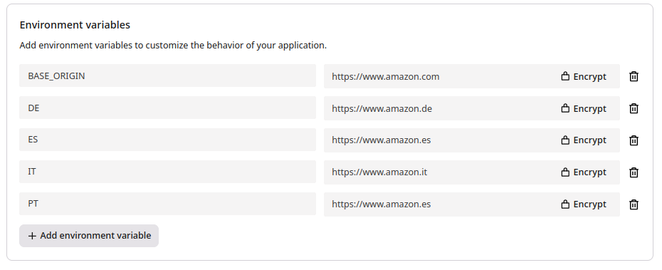

⏮️ Back to javascript [README.md](../../README.md)

# Geo Redirect <a href="https://portal.gcore.com/fastedge/create-template-app/6" style="display: inline-block; background-color: #ff4c00; color: white; padding: 5px 14px; text-decoration: none; font-weight: bold; border-radius: 4px; margin: 5px 20px; font-size: 17px;">Deploy Now</a>

This application does a simple redirect based on the clients location.

It takes a `BASE_ORIGIN` url, which is where landing clients will be redirected to by default.

However for each additional environment_variable that is a valid country-code, it will redirect to its value.

e.g.

