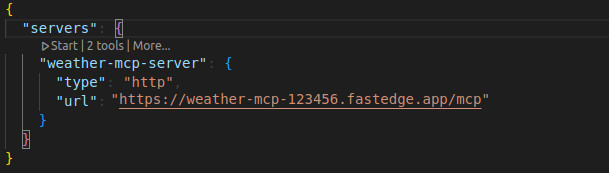
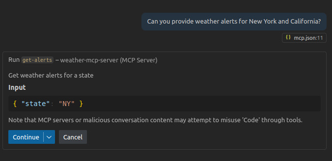
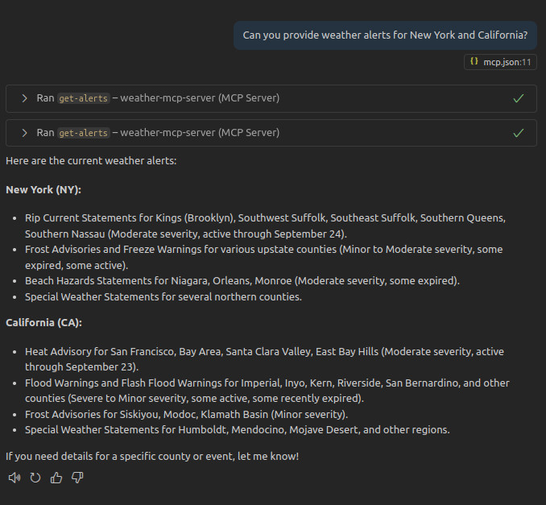
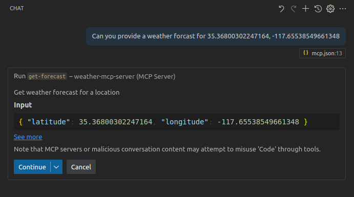
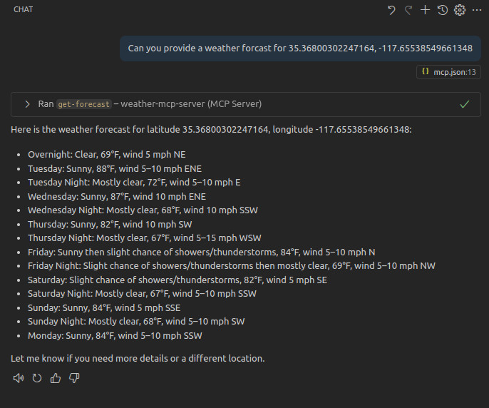
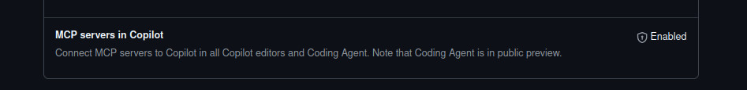
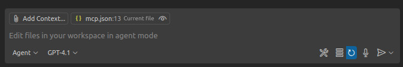

# MCP Server

This is an example provided by [Model Context Protocol](https://github.com/modelcontextprotocol/quickstart-resources/blob/main/weather-server-typescript/README.md) - A Simple MCP weather server.

It is apart of their `Quickstart Resources` and has significant documentation on how to build it for Node [here](https://modelcontextprotocol.io/docs/develop/build-server#node).

This example is a demonstration on how to build it to run on the `FastEdge` network.

## Getting Started

### Setting up your environment

First, let’s install Node.js and npm if you haven’t already. You can download them from [nodejs.org](https://nodejs.org/en).

Verify your Node.js installation:

```sh
node --version
npm --version
```

For this tutorial, you’ll need Node.js version 18 or higher.

Now, let’s create and set up our project:

```sh

# Create a new directory for our project
mkdir weather
cd weather

# Initialize a new npm project
npm init -y

# Install dependencies
npm install @modelcontextprotocol/sdk zod@3 @gcoredev/fastedge-sdk-js @hono/mcp hono
npm install -D typescript

# Create our files
mkdir src
touch src/index.ts
touch src/server.ts
touch src/types.ts
```

Update your package.json to add type: “module” and a build scripts:

```json
{
  "type": "module",
  "scripts": {
    "build": "npm run transpile && npm run build-wasm",
    "build-wasm": "npx fastedge-build --input build/index.js --output build/weather.wasm --tsconfig tsconfig.json",
    "transpile": "tsc && node -e \"require('fs').chmodSync('build/index.js', '755')\""
  }
}
```

Create a `tsconfig.json` in the root of your project:

```json
{
  "compilerOptions": {
    "target": "ES2022",
    "module": "Node16",
    "moduleResolution": "Node16",
    "outDir": "./build",
    "rootDir": "./src",
    "strict": true,
    "esModuleInterop": true,
    "skipLibCheck": true,
    "forceConsistentCasingInFileNames": true,
    "types": ["@gcoredev/fastedge-sdk-js"]
  },
  "include": ["src/**/*"],
  "exclude": ["node_modules"]
}
```

Now let’s dive into building your server.

## Building your server

### Importing packages and setting up the instance

Add these to the top of your `src/server.ts`:

```ts
import { McpServer } from "@modelcontextprotocol/sdk/server/mcp.js";
import { z } from "zod";

import type {
  AlertFeature,
  AlertsResponse,
  ForecastPeriod,
  ForecastResponse,
  PointsResponse,
} from "./types.js";

const NWS_API_BASE = "https://api.weather.gov";
const USER_AGENT = "weather-app/1.0";

// Create server instance
const server = new McpServer({
  name: "weather",
  version: "1.0.0",
});

// Add Helper functions and tools here...

export default server;
```

### Helper Functions

Next, let’s add our helper functions for querying and formatting the data from the National Weather Service API:

```ts
// Helper function for making NWS API requests
async function makeNWSRequest<T>(url: string): Promise<T | null> {
  const headers = {
    "User-Agent": USER_AGENT,
    Accept: "application/geo+json",
  };

  try {
    const response = await fetch(url, { headers });
    if (!response.ok) {
      throw new Error(`HTTP error! status: ${response.status}`);
    }
    return (await response.json()) as T;
  } catch (error) {
    console.error("Error making NWS request:", error);
    return null;
  }
}

// Format alert data
function formatAlert(feature: AlertFeature): string {
  const props = feature.properties;
  return [
    `Event: ${props.event || "Unknown"}`,
    `Area: ${props.areaDesc || "Unknown"}`,
    `Severity: ${props.severity || "Unknown"}`,
    `Status: ${props.status || "Unknown"}`,
    `Headline: ${props.headline || "No headline"}`,
    "---",
  ].join("\n");
}
```

### Implementing tool execution

The tool execution handler is responsible for actually executing the logic of each tool. Let’s add it:

```ts
// Register weather tools
server.tool(
  "get_alerts",
  "Get weather alerts for a state",
  {
    state: z.string().length(2).describe("Two-letter state code (e.g. CA, NY)"),
  },
  async ({ state }) => {
    const stateCode = state.toUpperCase();
    const alertsUrl = `${NWS_API_BASE}/alerts?area=${stateCode}`;
    const alertsData = await makeNWSRequest<AlertsResponse>(alertsUrl);

    if (!alertsData) {
      return {
        content: [
          {
            type: "text",
            text: "Failed to retrieve alerts data",
          },
        ],
      };
    }

    const features = alertsData.features || [];
    if (features.length === 0) {
      return {
        content: [
          {
            type: "text",
            text: `No active alerts for ${stateCode}`,
          },
        ],
      };
    }

    const formattedAlerts = features.map(formatAlert);
    const alertsText = `Active alerts for ${stateCode}:\n\n${formattedAlerts.join(
      "\n"
    )}`;

    return {
      content: [
        {
          type: "text",
          text: alertsText,
        },
      ],
    };
  }
);

server.tool(
  "get_forecast",
  "Get weather forecast for a location",
  {
    latitude: z.number().min(-90).max(90).describe("Latitude of the location"),
    longitude: z
      .number()
      .min(-180)
      .max(180)
      .describe("Longitude of the location"),
  },
  async ({ latitude, longitude }) => {
    // Get grid point data
    const pointsUrl = `${NWS_API_BASE}/points/${latitude.toFixed(
      4
    )},${longitude.toFixed(4)}`;
    const pointsData = await makeNWSRequest<PointsResponse>(pointsUrl);

    if (!pointsData) {
      return {
        content: [
          {
            type: "text",
            text: `Failed to retrieve grid point data for coordinates: ${latitude}, ${longitude}. This location may not be supported by the NWS API (only US locations are supported).`,
          },
        ],
      };
    }

    const forecastUrl = pointsData.properties?.forecast;
    if (!forecastUrl) {
      return {
        content: [
          {
            type: "text",
            text: "Failed to get forecast URL from grid point data",
          },
        ],
      };
    }

    // Get forecast data
    const forecastData = await makeNWSRequest<ForecastResponse>(forecastUrl);
    if (!forecastData) {
      return {
        content: [
          {
            type: "text",
            text: "Failed to retrieve forecast data",
          },
        ],
      };
    }

    const periods = forecastData.properties?.periods || [];
    if (periods.length === 0) {
      return {
        content: [
          {
            type: "text",
            text: "No forecast periods available",
          },
        ],
      };
    }

    // Format forecast periods
    const formattedForecast = periods.map((period: ForecastPeriod) =>
      [
        `${period.name || "Unknown"}:`,
        `Temperature: ${period.temperature || "Unknown"}°${
          period.temperatureUnit || "F"
        }`,
        `Wind: ${period.windSpeed || "Unknown"} ${period.windDirection || ""}`,
        `${period.shortForecast || "No forecast available"}`,
        "---",
      ].join("\n")
    );

    const forecastText = `Forecast for ${latitude}, ${longitude}:\n\n${formattedForecast.join(
      "\n"
    )}`;

    return {
      content: [
        {
          type: "text",
          text: forecastText,
        },
      ],
    };
  }
);
```

### Creating the types

Add this to the top of your `src/types.ts`:

```ts
export interface AlertFeature {
  properties: {
    event?: string;
    areaDesc?: string;
    severity?: string;
    status?: string;
    headline?: string;
  };
}

export interface ForecastPeriod {
  name?: string;
  temperature?: number;
  temperatureUnit?: string;
  windSpeed?: string;
  windDirection?: string;
  shortForecast?: string;
}

export interface AlertsResponse {
  features: AlertFeature[];
}

export interface PointsResponse {
  properties: {
    forecast?: string;
  };
}

export interface ForecastResponse {
  properties: {
    periods: ForecastPeriod[];
  };
}
```

### Creating the server

Finally, implement the main function to run the server in `src/index.ts`:

```ts
import { StreamableHTTPTransport } from "@hono/mcp";
import { Hono } from "hono";

import server from "./server.js";

const router = new Hono();

router.all("/mcp", async (c) => {
  const transport = new StreamableHTTPTransport();
  await server.connect(transport);
  return transport.handleRequest(c);
});

addEventListener("fetch", (event: FetchEvent) => {
  event.respondWith(router.fetch(event.request));
});
```

### Building the wasm binary

Make sure to run:

```sh
npm run build
```

This step will transpile your code and build it into a wasm binary in the [./build](./build/) directory.

## Running the MCP Server.

This binary can now be uploaded to the FastEdge network using the UI and/or API. [More on this](https://gcore.com/docs/fastedge/getting-started/create-fastedge-apps#in-the-customer-portal)

### Testing your server with VSCode Copilot

First we need to make a `mcp.json` within your project.

```sh
mkdir .vscode
touch .vscode/mcp.json
```

Add the server config to `.vscode/mcp.json`:

```json
{
  "servers": {
    "weather-mcp-server": {
      "type": "http",
      "url": "https://weather-mcp-123456.fastedge.app/mcp"
    }
  }
}
```

> **NOTE:** Edit your url to be pointed at the new FastEdge application you just created.

This tells VSCode Copilot that there is an MCP Server called `weather-mcp-server` available.

You can now click `Start` to start the server.



> **TROUBLE-SHOOTING:** If these server actions are not visible try restarting VSCode.

### Copilot use

Now with the server running you are able to request data from your new MCP Server:









## What's happening under the hood

When you ask a question:

1. The client sends your question to Copilot
2. Copilot analyzes the available tools and decides which one(s) to use
3. The client executes the chosen tool(s) through the MCP server
4. The results are sent back to Copilot
5. Copilot formulates a natural language response
6. The response is displayed to you!

## Troubleshooting

### Cannot get your server to start:

- Try restarting VSCode.
- Ensure you have MCP Servers enabled in your [GitHub Settings](https://github.com/settings/copilot/features)



### Copilot chat is not discovering your tools

- Try starting a new Copilot chat session.
- Ensure you are using `Agent` mode


