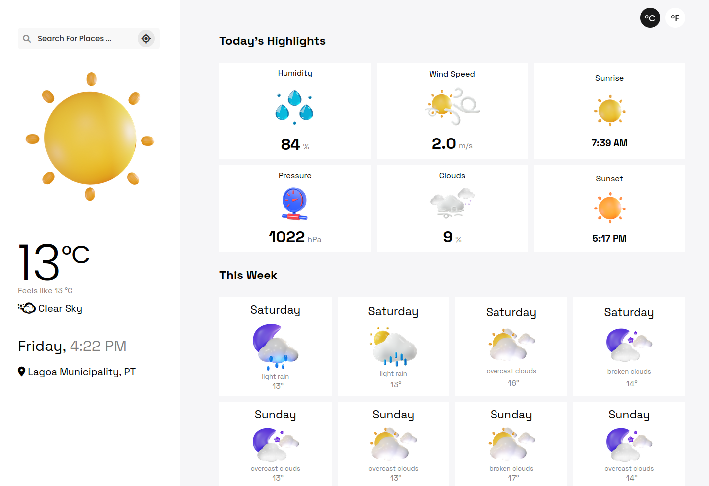
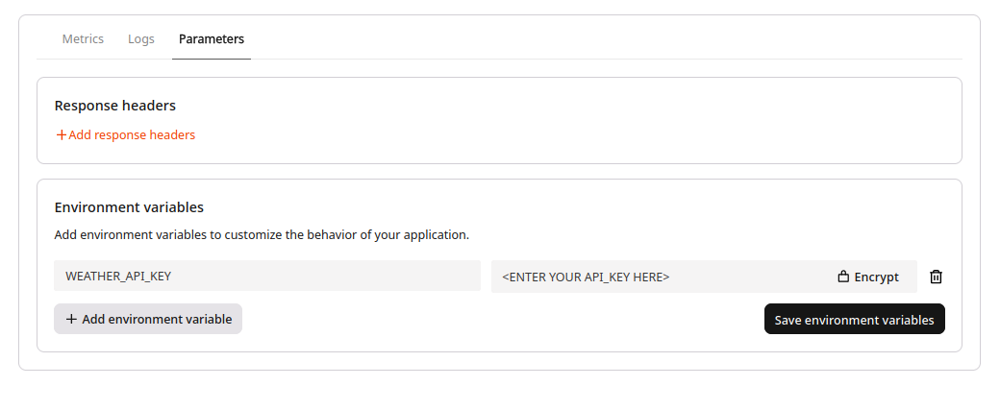

⏮️ Back to javascript [README.md](../../README.md)

# React App Example

This is an example of building a React Weather app and how to deploy it to FastEdge.

### Preview



This app uses the Open Weather Api to collect and render data. You can get an api key [here](https://home.openweathermap.org/api_keys).

## How it works

During the build process it takes all of your front-end code and embeds it into the wasm binary. This allows the FastEdge static-server to serve your React site to the browser [(read more)](https://g-core.github.io/FastEdge-sdk-js/guides/serving-a-static-site/).

Apart from serving your React site, this example also provides some back-end routes: `/current` & `/forecast`.

To simplify this back-end server we have utilized [itty-router](https://www.npmjs.com/package/itty-router). This allows for quick and easy handling of requests. Applying middleware (as needed) and serving back-end responses, falling back to the FastEdge static-server for any unknown requests.

The code for this back-end can be found in [fastedge-server/index.ts](./fastedge-server/index.ts).

There is also a basic [esbuild](./esbuild/server.js) pipline to help construct the server code ready for building with the FastEdge-sdk-js.

## Building

Within the react-app folder:

```sh
npm install
```

Followed by

```sh
npm run build
```

This will build the React front-end into the `./build` folder, ready for embedding into the binary.

It will also build the `./fastedge-server` into the `./.fastedge/static-index.js` ready for including into the FastEdge-sdk-js build step.

Finally it will run this `fastedge-build -c` command creating and outputting the `react-app.wasm` [here](../../dist/).

## Running

This binary can now be uploaded to the FastEdge network using the UI and/or API. [More on this](https://gcore.com/docs/fastedge/getting-started/create-fastedge-apps#in-the-customer-portal)

You will need to provide an Environment Variable containing your "Open Weather" API_KEY. ( [get an api key](https://home.openweathermap.org/api_keys) )


