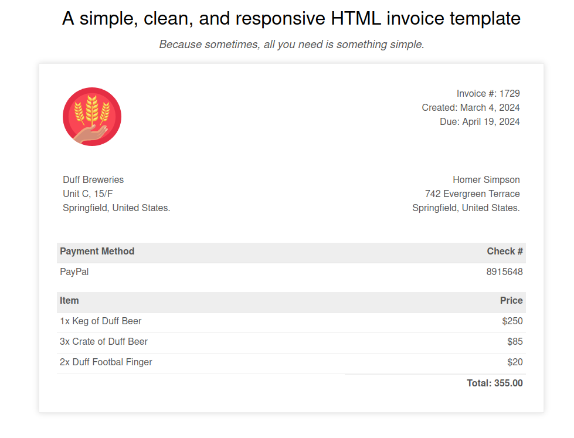

⏮️ Back to javascript [README.md](../../README.md)

# Template Invoice

This application is a simple HTML invoice generated using [Handlebars](https://handlebarsjs.com/) templates.

It uses a simple invoiceData object and renders an html invoice.

```js
const invoiceData = {
  createdDate: "March 4, 2024",
  dueDate: "April 19, 2024",
  invoiceNumber: "1729",
  recipientAddress: {
    name: "Homer Simpson",
    address1: "742 Evergreen Terrace",
    address2: "Springfield, United States.",
  },
  paymentMethod: "PayPal",
  paymentId: "8915648",
  items: [
    {
      description: "1x Keg of Duff Beer",
      price: 250,
    },
    {
      description: "3x Crate of Duff Beer",
      price: 85,
    },
    {
      description: "2x Duff Footbal Finger",
      price: 20,
    },
  ],
};
```


