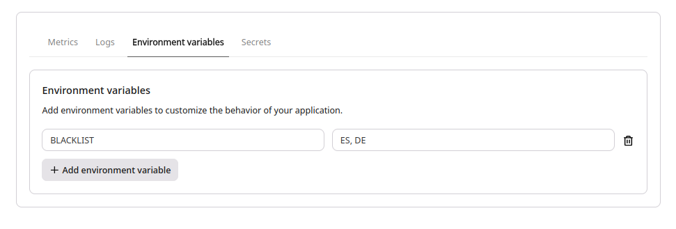

⏮️ Back to Rust [README.md](../../README.md)

# Geo Block

This application performs a simple check on the `country` code.

If the country code exists within the `BLACKLIST` environment variable it denies access.

e.g.

